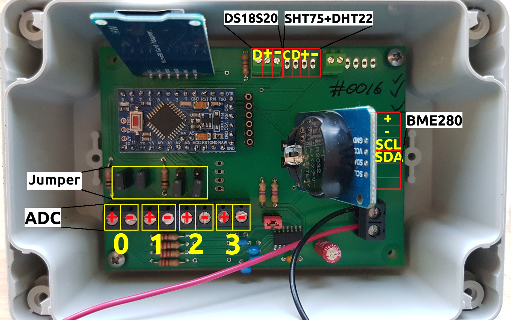

# Loguino

The Loguino is a low budget and open-source data acquisition device based on an Arduino Pro Mini and designed for monitoring e.g. tree growth dynamics, climate or other environmental parameters at remote locations. It is capable of reading analog inputs as voltage signals at a resolution of 18-bit and almost any kind of digital sensors can be connected using standard protocols (e.g. I²C, SPI, 1-Wire or SDI-12). Logging interval can be set from some seconds to hours and data are stored as comma seperated .csv file to a 4GB (or 8GB) micro sd-card. Therefore, no special software or hardware is needed to readout the Loguino. While the Loguino is in a low power sleep mode in between logs, consuming only about 100µA, a Real-Time-Clock Module (RTC DS3231) keeps track of time and wakens the Loguino for the next log event. Interrupts can independently be counted without interrupting main routines, in order to monitor rainfall or windspeed. The Loguino board togheter with a standard Lithium-Ion 18650 battery (keeps the Loguino running for about a year) is mounted within a rugged enclosure (IP65) that can be attached to a tree or pole, for instance.

The eagle files for the PCB are available in this repository and all parts are easily available on the internet, however, ready-to-use (assembled, programmed and tested) Loguinos are for sale by sending a request to armin.niessner@taysira.org. All Arduino libraries and sketches needed for operation of the Loguino are available in this repository or at other git repositories (listed below). The Arduino software needed to program the Loguino is available at [Arduino](https://www.arduino.cc/).

# Parts

* Arduino Pro Mini 3.3V, 8MHz, ATmega328 (e.g. [Amazon](https://www.amazon.de/gp/product/B078H9RMZY/ref=ppx_yo_dt_b_asin_title_o07_s01?ie=UTF8&psc=1))

* FTDI Adapter FT232RL USB to TTL Serial (3.3V, 5V) (e.g. [Amazon](https://www.amazon.de/AZDelivery-Adapter-FT232RL-Serial-gratis/dp/B01N9RZK6I/ref=sr_1_3?__mk_de_DE=%C3%85M%C3%85%C5%BD%C3%95%C3%91&keywords=FTDI&qid=1555957551&s=computers&sr=1-3))

* SPI micro sd-card shield (e.g. [Amazon](https://www.amazon.de/gp/product/B077MB17JB/ref=ppx_yo_dt_b_asin_title_o07_s00?ie=UTF8&psc=1))

* Real-Time-Clock RTC DS3231 (e.g. [Amazon](https://www.amazon.de/gp/product/B076GP5B94/ref=ppx_yo_dt_b_asin_title_o07_s02?ie=UTF8&psc=1))

* ADC MCP3424 (SOIC 14) 

* Screw terminals (5 x 5.08 mm 2pins, 4 x 2.54 mm 4 pins, 1 x 2.54 mm 3 pins, 1 x 2.54 mm 2 pins)

* Socket strip (6 pins, to connect the FTDI adapter)

* Pin strip (51 pins in total to place the Arduino Pro Mini onto the PCB and for bridges)

* Bridges (maximum 5)

* Resistors (2 x 10 KOhm, 3 x 4.7 KOhm, 4 x 2.2 KOhm)

* Ceramic capacitors (1 x 100 nF, 4 x 3.3 nF)

* Electrolytic capacitor (1 x 10µF)

* Micro sd-card (4 GB or 8 GB, quality may differ significantly between different manufacturer and even production lines, leading to a higher power consumption during sleep mode. I use and recommend Transcend TS4GUSDC4 Micro SDHC 4GB Class 4)

* Li-ion 18650 battery

* Li-ion 18650 battery tray

* Enclosure (Bopla ET 215 120 x 80 x 57)

* Cable glands (1-x, depending on number of cables to enter the enclosure)

* PCB (eagle files available in this repository or contact armin.niessner@taysira.org)

# Assembly

1. Solder the Arduino Mini Pro Board on to the PCB using pins.

1. Remove the power LED and voltage regulator on the Arduino Pro Mini.

1. Solder the socket strip next to the Arduino Pro Mini for connection to the FTDI. Test the Arduino by uploading the first test sketch ("test_1_arduino.ino") and check the serial monitor for the output.

1. Prepare soldering areas for the ADC on the PCB with soldering fluid and solder the ADC MCP3424 onto the PCB.

1. Solder the two 4.7K Resistors, the 0.1µF ceramic capacitor, the 10µF ELKO and two pins next to the ADC. Place a bridge on the two pins.

1. Upload test script "test_2_adc.ino" and open serial monitor. The serial monitor should show random numbers for all four channels.

1. Solder all screw terminals, resistors, capacitors and pins onto PCB.

1. Repeat ADC test.

1. Remove voltage regulator from the SD-card-module, connect lower two pins with a piece of wire and remove the overlapping part of the SD-module-PCB under the pins using a "Dremel".

1. Solder the SD-module to the PCB and test it by uploading the test script "test_3_sd.ino". Check the serial monitor for error messages.

1. Remove the LED and upper resistor-IC from the RTC-module and solder the RTC-module to the PCB. Test it by uploading the script "test_4_rtc.ino" and check the serial monitor.

# Sensors

### Dendrometer (linear displacement potentiometer, MMR10_11 R5K, Megatron Elektronik AG & Co, Munich, Germany):

* Green = `ADC0 +` (left)

* Yellow = `ADC0 -` (middle)

* Red = `ADC1 +` (right)

* Bridges at `ADC0 -` and `ADC1 -` have to be connected

Example sketch: [Loguino_dd_dd](https://github.com/ArminNiessner/Loguino/tree/master/sketches/Examples/Loguino_dd_dd/Loguino_dd_dd.ino)

### Thermocouple (Granier-sap-flow sensor):

* Connect one end to `ADCx +` and the other end to `ADCx -`

* leave the bridge at `ADCx -` open

Example sketch: [Loguino_4xyl](https://github.com/ArminNiessner/Loguino/tree/master/sketches/Examples/Loguino_4xyl/Loguino_4xyl.ino)

### DS18S20 temperature:

* GND = `-` (right)

* VCC = `+` (middle, to Pin 6)

* DATA = `D` (left, to Pin 4)

Example sketch: [Loguino_dd_xyl_t](https://github.com/ArminNiessner/Loguino/tree/master/sketches/Examples/Loguino_dd_xyl_t/Loguino_dd_xyl_t.ino)

### DHT22 T/RH sensor:

* GND = `-` (right)
* VCC = `+` (second from right)
* Data = `D` (second from left, to pin 9)

Example sketch: [Loguino_DHT](https://github.com/ArminNiessner/Loguino/tree/master/sketches/Examples/Loguino_DHT/Loguino_DHT.ino)

### SHT7x Sensirion T/RH sensor:

* SCK = `C` (left, to Pin 7

* DATA = `D` (second from left, to Pin 9)

* VCC = `+` (second from right, to Pin 6)

* GND = `-` (right)

Example sketch: [Loguino_SHT](https://github.com/ArminNiessner/Loguino/tree/master/sketches/Examples/Loguino_SHT/Loguino_SHT.ino)

### BME280 T/RH/Pressure sensor:

* VCC = `+` (top, to pin 5)
* GND = `-` (second from top)
* SCL = `SCL` (third from top)
* SDA = `SDA` (third from bottom)

Example sketch: [Loguino_BME](https://github.com/ArminNiessner/Loguino/tree/master/sketches/Examples/Loguino_BME/Loguino_BME.ino)

# Software set up and programming the Loguino

1. Download and install the latest version of the [Arduino software](https://www.arduino.cc/en/Main/Software)
1. Download this repository and copy all the libraries from this repository to the "libraries"-folder in your Arduino installation folder.
1. Get the libraries [AVRUtils](https://github.com/SConaway/AVRUtils), [LowPower](https://github.com/rocketscream/Low-Power) and [SdFat](https://github.com/greiman/SdFat)
and copy them to the "libraries"-folder. If you want to use a DS18S20 temperature sensor or other digital sensors you have to get the corresponding library, listed below in the Libraries section.
1. Open one of the sketches from this repository with the Arduino software. Go to "Tools" and 
set "Board" to "Arduino Pro or Pro Mini". Go again to "Tools" and set "Processor" to "ATmega 328P (3.3V, 8MHz)".
1. Connect the FTDI Adapter to the Loguino board (upper side facing the Arduino Pro Mini, make sure
that the jumper on the FTDI Adapter is set to 3.3V) and connect the usb to a usb port. Go to "Tools"
and set "Port" to the appropiate port (e.g. COM3). If you are using windows, you probably first need to download and install a driver for the FTDI Adapter
(e.g. [here](https://www.campbellsci.com/downloads/usb-to-serial-driver-ftdi-chip-set)).
1. "Upload" the sketch (right arrow button) and wait until the sketch is compiled and uploaded.
Open the "Serial Monitor" (button at the upper right corner) and check the output.

## Setting the time
1. Use the [test_4_rtc.ino](https://github.com/ArminNiessner/Loguino/tree/master/sketches/Tests/test_4_rtc/test_4_rtc.ino)
to set the RTC to your system time.
2. Upload the sketch, comment `RTC.adjust(DateTime(__DATE__, __TIME__));` and upload the sketch again. The second 
upload with `//RTC.adjust(DateTime(__DATE__, __TIME__));` should be right after the first upload was finished, in order
to have only a short delay between RTC time and system time (usually less than 10 seconds).

## Final setup
Choose an appropiate example sketch from this repository and adjust it to your sensor setup:

* `uint8_t Log_Interval_Minutes = 1;` set to the desired logging intervall in minutes
* `String file_ini = "Lg0001";` set to the appropiate Logger ID
* If you want that logging starts at the next full minute, next full 10 minute (:00, :10, :20, ..),
next full half hour (:00, :30) or the next full hour, you can uncomment the appropiate block of coder
under `void setup() {....}` and uncomment the other blocks. 

Upload the sketch and your Loguino is ready to go.

## Libraries

* AVRUtils ([Git](https://github.com/SConaway/AVRUtils)) - measure supply voltage

* SPI ([Arduino](https://www.arduino.cc/en/reference/SPI)) - communication with SD-card module

* SdFat ([Git](https://github.com/greiman/SdFat)) - read and write to SD-card

* Wire ([Arduino](https://www.arduino.cc/en/reference/wire)) - communication with I²C devices e.g. the MCP3424

* LowPower ([Git](https://github.com/rocketscream/Low-Power)) - low power library to set Loguino to sleep

* ANiess (available in this repository) - main library for Loguino

* AN_RTClib (available in this repository) - library to interact with RTC

* MCP342x (available in this repository) - library to interact with the ADC

* DallasTemperature ([Git](https://github.com/milesburton/Arduino-Temperature-Control-Library))- library to interact with the DS18S20 temperature sensor

* Sensirion ([Git](https://github.com/spease/Sensirion)) - library to interact with the SHT75 T/RH sensor

